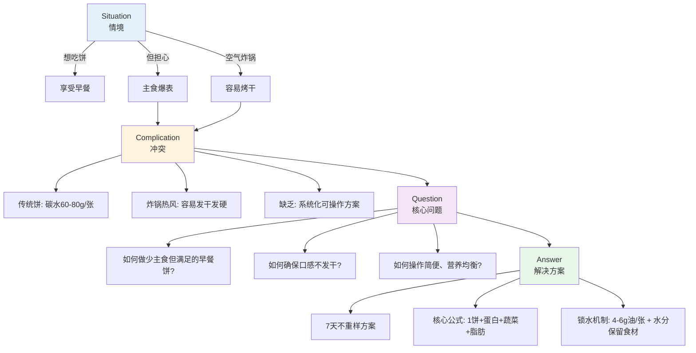
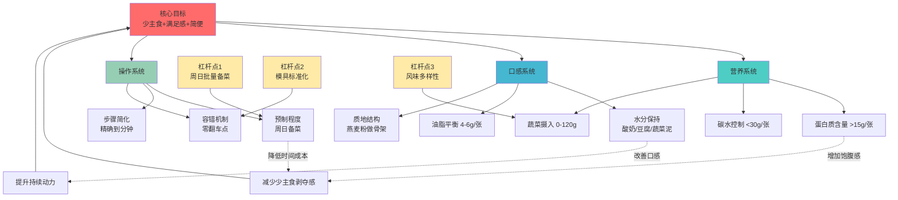
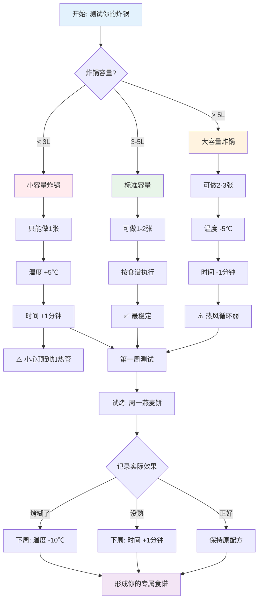
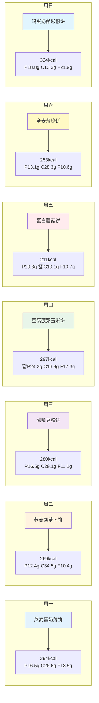
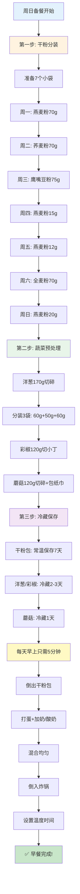
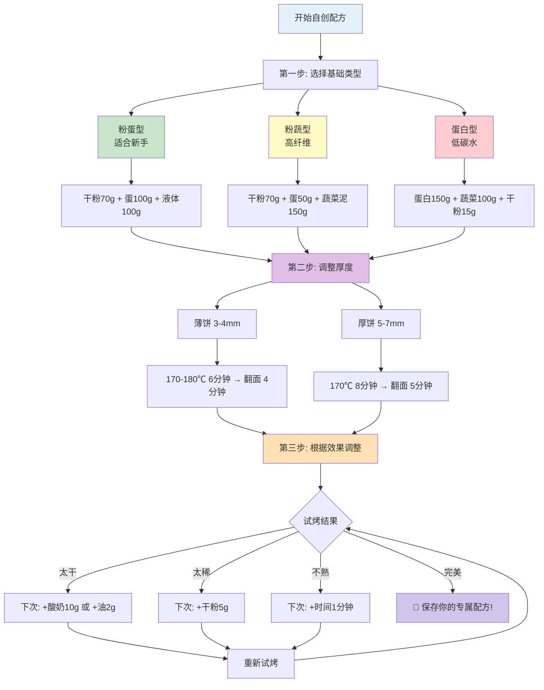
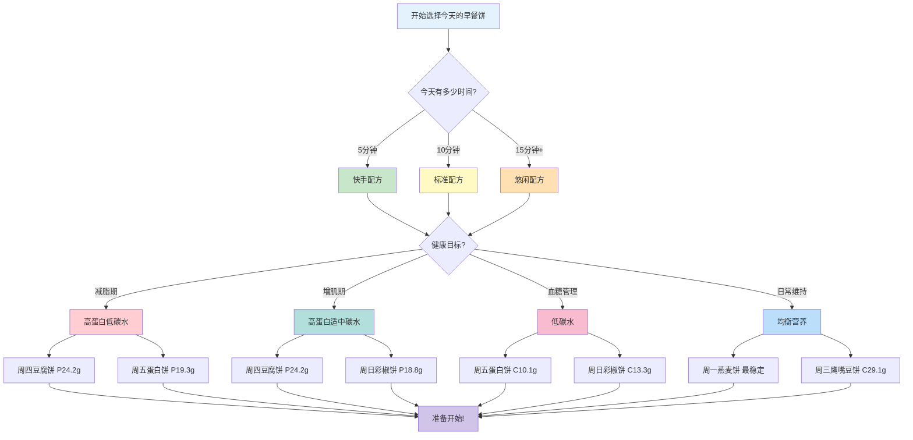

# 🍳 空气炸锅7天健康早餐饼（深度优化版）

> **少主食也能吃到"饼感"！新手友好·失败救援·灵活变通**

---

## 📋 数据来源说明

本指南营养数据基于以下权威来源（USDA标准）：
1. USDA FoodData Central（FDC）
2. NHS The Eatwell Guide
3. MyFoodData（燕麦/荞麦/鹰嘴豆/蛋奶/蔬菜等）

---

## 🎯 快速决策：这份指南适合你吗？

### ✅ 适合人群
- 想减脂但不想放弃"吃饼"的满足感
- 需要高蛋白早餐（健身/增肌/血糖管理）
- 早上时间紧张（15分钟内解决早餐）
- 有空气炸锅但不知道怎么用

### ⚠️ 不适合情况
- 对蛋类、奶制品、麸质过敏（参见【过敏原替代方案】）
- 空气炸锅容量<2L（无法正常烹饪）
- 追求传统煎饼口感（空气炸锅无法复刻油煎效果）

---

## 🚀 新手5分钟快速上手

### 第一步：从哪天开始？
**推荐从周一燕麦蛋奶薄饼开始**（成功率最高、口感最稳定）

### 第二步：最低装备检查
- [ ] 空气炸锅（容量≥3L最佳，<3L参见【设备适配表】）
- [ ] 硅胶刷（刷油用）
- [ ] 硅胶圆模或耐热小盘（可选，但强烈推荐，防止豆腐饼、蛋白饼碎裂）
- [ ] 烘焙纸（托着饼翻面用）

### 第三步：第一次就成功的3个秘诀
1. **跟着"零翻车点"做** → 第一次忽略口味变体，专注做对基础版
2. **判断熟度** → 插入牙签，拔出无粘液=熟了；有粘液继续烤1分钟
3. **先试烤一张** → 第一次只做一张，测试你的炸锅温差

### 第四步：记录你的炸锅特性
```markdown
我的炸锅：[品牌] [容量]L
测试方案：周一燕麦蛋奶薄饼
实际效果：[温度需±5℃] [时间需±1分钟]
备注：_____________________________________
```

---

## 📊 核心知识：为什么这样搭配？

### 原理1：蛋白+蔬菜=少主食也能饱

**科学机制**：
- 蛋白质消化速度慢，饱腹感持续时间是碳水化合物的2倍
- 蔬菜提供膳食纤维，延缓胃排空

**数据支撑**：
- 传统煎饼果子：碳水约80g/张 → 饱腹2-3小时
- 本方案早餐饼：碳水10-35g/张 + 蛋白15-24g → 饱腹4小时

**应用建议**：
- 选择蛋白含量>18g的配方（周四豆腐饼24g、周五蛋白饼19g）
- 燕麦粉/鹰嘴豆粉配方适合活动量大的日子（碳水适中，饱腹强）

---

### 原理2：油脂+酸奶=口感不发柴

**科学机制**：
- 油脂润滑面筋网络，防止蛋白质烤干变硬
- 酸奶保持水分，避免高温脱水

**数据支撑**：
- 每张饼油<4g → 干硬风险↑50%
- 每张饼油4-6g + 酸奶/豆腐 → 湿软成功率>90%

**应用建议**：
- 宁可多2g油，也不要少（烤完可用吸油纸控油）
- 如果面糊太稠，优先加酸奶（补水+补蛋白），而非加水

---

### 原理3：蔬菜挤水=避免夹生

**科学机制**：
- 蔬菜高温出水 → 饼心湿软
- 延长烘烤时间 → 外焦内生

**数据支撑**：
- 胡萝卜挤水后失重30%，但烘烤时间减少2分钟
- 蘑菇不挤水 → 失败率↑70%

**应用建议**：
- 胡萝卜、蘑菇、菠菜**必须挤水**（纸巾按压至不出水）
- 挤出来的蔬菜水可以代替部分牛奶（营养不流失）

---



## 🎓 什么是"少主食"？

### 定义标准
- **传统早餐饼**（煎饼果子/葱油饼）：碳水60-80g/张
- **本方案早餐饼**：碳水10-35g/张
- **"少主食"标准**：每张饼碳水<30g

### 适用场景
| 场景 | 推荐配方 | 碳水范围 |
|------|----------|----------|
| 减脂期 | 周四豆腐饼、周五蛋白饼 | 10-17g |
| 血糖管理 | 周五蛋白饼、周日彩椒饼 | 10-13g |
| 轻断食日 | 周四豆腐饼、周五蛋白饼 | 10-17g |
| 运动日前 | 周一燕麦饼、周二荞麦饼 | 26-35g |
| 维持期 | 所有配方 | 10-35g |

### 营养数据说明
- **计算方式**：按原料生重计算（USDA标准）
- **实际调整**：烹饪失水10-15%，实际营养密度×1.1
- **建议**：关注蛋白含量>15g/张（核心指标）

---



## 🧯 设备适配指南

### 空气炸锅容量适配

| 容量 | 一次可做 | 调整建议 | 风险提示 |
|------|----------|----------|----------|
| <3L | 1张 | 温度+5℃，时间+1分钟 | 容易顶到加热管→烤糊 |
| 3-5L | 1-2张 | 按食谱执行 | 标准容量，最稳定 |
| >5L | 2-3张 | 温度-5℃，时间-1分钟 | 空间太大→热风循环弱 |

### 无预热功能调整
- 所有方案时间**+2分钟**
- 或手动预热：空锅运行200℃ 3分钟



### 推荐测试流程
1. **第一周**：按原食谱执行，记录实际效果
2. **第二周**：根据记录调整（如：周一方按180℃→改成175℃）
3. **第三周**：形成你的"专属食谱"

---

## 🚑 失败救援手册

```mermaid
graph TD
    Problem[出现了问题!] --> Q1{问题类型?}

    Q1 -->|烤糊了| Burnt[烤糊问题]
    Q1 -->|太干了| Dry[太干问题]
    Q1 -->|不成型| Broken[不成型问题]
    Q1 -->|不熟| Under[不熟问题]
    Q1 -->|不好吃| Taste[口味问题]

    Burnt --> B1{糊的程度?}
    B1 -->|轻微| B1a[刮掉糊的部分]
    B1a --> B1b[剩余部分食用]
    B1 -->|严重| B2a[掰碎做沙拉topping]
    B2a --> B2b[或做酸奶格兰诺拉]

    Dry --> D1[切块泡牛奶/酸奶]
    D1 --> D2[或切碎煮汤代替面包丁]
    D2 --> D3[或打碎加蜂蜜做能量球]

    Broken → Br1[压碎加蜂蜜捏成能量球]
    Br1 --> Br2[或拌酸奶做早餐碗]
    Br2 --> Br3[或加鸡蛋炒碎]

    Under --> U1[切小块回炉170℃ 3分钟]
    U1 --> U2[或微波炉中火1分钟]

    Taste --> T1[蘸酱遮盖]
    T1 --> T2[切碎拌沙拉稀释]
    T2 --> T3[加调味料调整]

    B1b --> Prev[预防措施]
    B2b --> Prev
    D3 --> Prev
    Br3 --> Prev
    U2 --> Prev
    T3 --> Prev

    Prev --> Prev1[记录问题]
    Prev1 --> Prev2[下次按预防措施调整]
    Prev2 --> Prev3[形成你的专属食谱]

    style Problem fill:#ffebee
    style Burnt fill:#ffcdd2
    style Dry fill:#ffe0b2
    style Broken fill:#fff9c4
    style Under fill:#e1bee7
    style Taste fill:#c8e6c9
    style Prev fill:#b3e5fc
```

### Q1：饼烤糊了怎么办？
**救援方案**：
- 轻微糊：刮掉糊的部分，剩余食用
- 严重糊：掰碎做沙拉topping或酸奶格兰诺拉

**预防措施**：
- 下次温度-10℃，时间-1分钟
- 设置手机定时器（不要依赖炸锅定时器，不准）

---

### Q2：饼太干了怎么办？
**救援方案**：
- 切块泡牛奶/酸奶（变成隔夜燕麦）
- 切碎加蔬菜煮汤（代替面包丁）
- 打碎做能量球（加蜂蜜捏圆）

**预防措施**：
- 增加酸奶10g或油2g
- 缩短烘烤时间1分钟
- 取出后立刻刷油1g（锁住水分）

---

### Q3：饼不成型/散了怎么办？
**救援方案**：
- 压碎做成"能量球"（加蜂蜜/椰蓉捏圆）
- 拌酸奶做"早餐碗"（代替格兰诺拉）
- 加鸡蛋炒碎（变成炒蛋粒）

**预防措施**：
- 面糊必须静置10分钟（让干粉吸水）
- 蔬菜必须挤水（胡萝卜、蘑菇、菠菜）
- 增加燕麦粉5g（加强结构）

---

### Q4：不熟/夹生怎么办？
**救援方案**：
- 切小块回炉170℃ 3分钟
- 或微波炉中火1分钟（快速补救）

**预防措施**：
- 插入牙签检验（无粘液=熟）
- 豆腐饼、蛋白饼必须用模具（定型）
- 蔬菜切小丁（≤0.5cm，更容易熟）

---

### Q5：味道不习惯怎么办？
**救援方案**：
- 蘸酱遮盖（酸奶、番茄酱、辣椒酱）
- 切碎拌沙拉（稀释味道）
- 加调味料（胡椒、孜然、香草）

**预防措施**：
- 第一次做原味（不加特殊调料）
- 逐渐增加新味道（从熟悉的胡椒开始）

---

## 🔀 食材替代速查表

### 干粉类（1:1替代）
| 原食材 | 可替代 | 注意事项 |
|--------|--------|----------|
| 燕麦粉 | 全麦粉、荞麦粉 | 口感略有差异 |
| 鹰嘴豆粉 | 豆腐泥100g | 水分需-20g |
| 全麦粉 | 燕麦粉、荞麦粉 | 1:1替换 |

---

### 蛋白类
| 原食材 | 可替代 | 比例 |
|--------|--------|------|
| 全蛋1个 | 蛋清2个+蛋黄1个 | 1:1 |
| 酸奶50g | 牛奶40g+蛋清10g | 1:1 |
| 豆腐100g | 鸡蛋2个 | 水分-20g |

---

### 蔬菜类（等量替代）
| 原食材 | 可替代 | 处理方式 |
|--------|--------|----------|
| 胡萝卜 | 南瓜、红薯 | 蒸熟压泥 |
| 菠菜 | 小白菜、油菜 | 焯水挤水 |
| 彩椒 | 茄子、西葫芦 | 切小丁，挤水 |

---

### 调味类（功能替代）
| 原食材 | 可替代 | 风味变化 |
|--------|--------|----------|
| 黑胡椒 | 白胡椒 | 更温和 |
| 孜然 | 十三香 | 中式风味 |
| 柠檬皮屑 | 柠檬汁5g | 酸味更明显 |
| 蒜粉 | 蒜泥3g | 鲜味更浓 |

---

## ⚠️ 过敏原警示与替代方案

### 常见过敏原清单
- **蛋类**：周一、周二、周三、周四、周日配方
- **乳制品**：所有配方（牛奶/酸奶/奶酪）
- **麸质**：周一（燕麦）、周二（荞麦）、周六（全麦）
- **大豆**：周四（豆腐）

### 替代方案表
| 食材 | 潜在过敏原 | 替代方案 | 比例 |
|------|------------|----------|------|
| 鸡蛋 | 蛋白过敏 | 亚麻籽粉30g+水60g | 搅拌5分钟至黏稠 |
| 牛奶 | 乳糖不耐受 | 豆浆/椰奶/燕麦奶 | 1:1 |
| 酸奶 | 乳糖不耐受 | 无糖酸奶/椰奶酸奶 | 1:1 |
| 小麦粉 | 麸质过敏 | 荞麦粉/鹰嘴豆粉 | ×1.2 |
| 芝士 | 乳蛋白过敏 | 营养酵母粉5g | 调味作用 |

---

## 💾 保存与复热指南

### 保存方式对比
| 方式 | 时间 | 口感损失 | 复热方法 | 适用配方 |
|------|------|----------|----------|----------|
| 当天食用 | 0小时 | 无 | / | 所有 |
| 冷藏保存 | 1-2天 | 10% | 空气炸锅150℃ 3分钟 | 燕麦饼、荞麦饼、鹰嘴豆饼 |
| 冷冻保存 | 7天 | 20% | 解冻后150℃ 5分钟 | 燕麦饼、全麦饼 |
| 常温保存 | <4小时 | 5% | 微波炉中火30秒 | 所有（夏天<2小时） |

### 不推荐保存的配方
❌ **周四豆腐饼**（出水严重，冷藏后口感崩塌）
❌ **周五蛋白饼**（蘑菇易变质）
❌ **周二荞麦饼**（洋葱易变质）

### 批量备餐建议
**周日备菜**（节省早晨时间）：
1. 干粉分装：按配方用量装7个小袋
2. 蔬菜预处理：切好分装（洋葱、彩椒、蘑菇）
3. 蛋奶类：当天早上准备（不提前打蛋）

---

## 💰 成本估算（2024年12月北京均价）

### 7天总食材成本
| 档次 | 总成本 | 每张饼成本 | 对比外卖节省 |
|------|--------|------------|--------------|
| 普通超市 | 约85元 | 6-7元 | 40-50% |
| 有机食材 | 约110元 | 8-9元 | 30-40% |
| 外卖对比 | 约150元 | 10-15元 | / |

### 性价比优化技巧
1. **季节性蔬菜**：冬季胡萝卜比彩椒便宜30%
2. **购买小包装**：避免食材浪费（特别是豆腐、酸奶）
3. **批量制备半成品**：周末切好蔬菜分装（降低人工成本）
4. **替代方案**：
   - 车达奶酪 → 营养酵母粉（节省60%）
   - 希腊酸奶 → 普通酸奶+蛋清（节省40%）

---

## 🗓️ 7天不重样方案



**图例说明**：
- 🏆 = 最优选择
- P = 蛋白质（Protein）
- C = 碳水化合物（Carbs）
- F = 脂肪（Fat）

---

## 周一｜1 燕麦蛋奶薄饼（新手友好）

**推荐理由**：成功率最高，适合第一次尝试

### ① 原料（2张）
- 燕麦粉 70g
- 全蛋约100g（≈2个）
- 牛奶 80g
- 低脂希腊酸奶 60g
- 橄榄油 10g

### ② 空气炸锅步骤
1. **预热**：空锅运行180℃ 3分钟
2. **首次烘烤**：180℃ 6分钟（用烘焙纸托着）
3. **翻面**：连纸取出，翻面后再放回
4. **二次烘烤**：170℃ 4分钟

### ③ 每张营养
294kcal｜蛋白16.5g｜碳水26.6g｜脂肪13.5g

### ④ 口味变体
**成人咸口**：
- 基础调味：黑胡椒+葱花
- 点睛之笔：柠檬皮屑少许（清爽提味）

**儿童微甜**：
- 面糊里加：玉米粒20g（从周四配方分出）
- 或撒：肉桂粉少许
- 点睛：酸奶蘸酱20g/张

### ⑤ 零翻车点
**问题**：面糊太稠 → 外焦内生
**解决**：
- 先静置5分钟再烤
- 若仍稠，加水10-20g调到"酸奶流动感"
- 测试：提起勺子，面糊缓慢滴落=正好

---

## 周二｜2 荞麦胡萝卜洋葱饼

**推荐理由**：天然甜味，儿童接受度高

### ① 原料（2张）
- 荞麦粉 70g
- 胡萝卜泥/细擦丝 120g
- 洋葱碎 60g
- 全蛋 50g（≈1个）
- 酸奶 80g
- 橄榄油 12g

### ② 空气炸锅步骤
1. **预热**：175℃ 3分钟
2. **首次烘烤**：175℃ 7分钟
3. **翻面**：170℃ 5分钟

### ③ 每张营养
269kcal｜蛋白12.4g｜碳水34.5g｜脂肪10.4g

### ④ 口味变体
**成人咸口**：
- 基础调味：孜然+胡椒
- 点睛：蒜粉0.5g（增香）

**儿童友好（天然甜）**：
- 胡萝卜本身带甜味
- 点睛：酸奶蘸酱20g+蜂蜜3g（可选）

### ⑤ 零翻车点
**问题**：胡萝卜出水 → 边缘散
**解决**：
- 胡萝卜擦丝后用纸巾挤一下水
- 油必须抹到位（每张≈6g）防止干硬

---

## 周三｜3 鹰嘴豆粉饼（少油）

**推荐理由**：高蛋白，适合增肌/健身日

### ① 原料（2张）
- 鹰嘴豆粉 75g
- 酸奶 80g
- 全蛋 50g（≈1个）
- 玉米 60g
- 橄榄油 10g（每张≈5g）

### ② 空气炸锅步骤
1. **预热**：180℃ 3分钟
2. **首次烘烤**：180℃ 6分钟
3. **翻面**：170℃ 5分钟

### ③ 每张营养
280kcal｜蛋白16.5g｜碳水29.1g｜脂肪11.1g

### ④ 口味变体
**成人咸口**：
- 基础调味：烟熏红椒粉+黑胡椒
- 点睛：苹果醋5g（刷在出炉表面，解腻）

**儿童友好（天然甜）**：
- 玉米做"甜粒"
- 点睛：酸奶蘸酱20g/张

### ⑤ 零翻车点
**问题**：鹰嘴豆粉"粉感重"→ 口感像吃粉
**解决**：
- 面糊必须静置10分钟再烤（让粉吸足水分）
- 静置后面糊会变稠，是正常现象

---

## 周四｜4 豆腐菠菜玉米饼（高蛋白之王）

**推荐理由**：蛋白质最高（24.2g/张），减脂期首选

### ① 原料（2张）
- 北豆腐 200g
- 菠菜 80g
- 玉米 80g
- 燕麦粉 15g（结构锁）
- 全蛋 50g（≈1个）
- 橄榄油 10g

### ② 空气炸锅步骤（重要！）
1. **预热**：170℃ 3分钟
2. **强烈建议**：用硅胶圆模/耐热小盘（成型锁）
3. **首次烘烤**：170℃ 8分钟（不翻！）
4. **静置定型**：取出连模静置2分钟（关键步骤）
5. **脱模翻面**：从模具中取出，翻面后再放回
6. **二次烘烤**：170℃ 4分钟

### ③ 每张营养
297kcal｜蛋白24.2g｜碳水16.9g｜脂肪17.3g

### ④ 口味变体
**成人咸口**：
- 基础调味：盐少许+胡椒
- 点睛：辣椒碎少许

**儿童友好（奶香/蘸酱二选一）**：
- 出炉抹：酸奶20g/张
- 点睛：芝士碎5g/张（可选）

### ⑤ 零翻车点
**问题**：豆腐/菠菜含水高 → 直接翻会碎
**解决**：
- 必须先"定型再翻面"（按上面步骤操作）
- 菠菜焯水后挤干水分（可用纸巾或手挤）

---

## 周五｜5 蛋白蘑菇洋葱饼（低碳水之王）

**推荐理由**：碳水最低（10.1g/张），严格控糖首选

### ① 原料（2张）
- 蛋清 200g
- 蘑菇 120g
- 洋葱 50g
- 燕麦粉 12g（结构锁）
- 酸奶 60g
- 车达奶酪 20g
- 橄榄油 12g（每张≈6g）

### ② 空气炸锅步骤
1. **预热**：170℃ 3分钟
2. **建议用模**：硅胶模/小盘更稳
3. **首次烘烤**：170℃ 7分钟（不翻）
4. **静置**：1分钟
5. **翻面**：170℃ 4分钟

### ③ 每张营养
211kcal｜蛋白19.3g｜碳水10.1g｜脂肪10.7g

### ④ 口味变体
**成人咸口**：
- 基础调味：黑胡椒+百里香
- 点睛：蘑菇先干煸/挤水再拌（更香）

**儿童友好（奶香）**：
- 奶酪就是"安全味"
- 点睛：酸奶蘸酱15g/张

### ⑤ 零翻车点
**问题**：蘑菇出水 → 饼心湿软
**解决**：
- 蘑菇切碎后用纸巾挤一下水
- 或先干煸2分钟（更香，更干）

---

## 周六｜6 全麦薄脆饼（轻断食日）

**推荐理由**：碳水适中，口感薄脆

### ① 原料（2张）
- 全麦粉 70g
- 酸奶 90g
- 牛奶 50g
- 全蛋 50g（≈1个）
- 橄榄油 12g（每张≈6g）

### ② 空气炸锅步骤
1. **预热**：170℃ 3分钟
2. **首次烘烤**：170℃ 6分钟
3. **翻面**：165℃ 5分钟（别上180℃，更容易干硬）

### ③ 每张营养
253kcal｜蛋白13.1g｜碳水28.3g｜脂肪10.6g

### ④ 口味变体
**成人咸口**：
- 基础调味：迷迭香+黑胡椒
- 点睛：出炉刷橄榄油1g/张（增亮增香）

**儿童友好（低钠刷酱）**：
- 酸奶20g+蜂蜜3g（可选）薄刷
- 点睛：肉桂粉

### ⑤ 零翻车点
**问题**：追求"薄脆"最怕烤过头变硬
**解决**：
- 厚度控制在3-4mm（太薄会碎，太厚不脆）
- 到点立刻出锅（余温会继续变脆）

---

## 周日｜7 鸡蛋奶酪彩椒洋葱饼（周末悠闲）

**推荐理由**：奶酪香浓，适合慢慢享用

### ① 原料（2张）
- 全蛋 150g（≈3个）
- 车达奶酪 60g
- 彩椒 120g
- 洋葱 60g
- 燕麦粉 20g
- 橄榄油 8g（每张≈4g）

### ② 空气炸锅步骤
1. **预热**：180℃ 3分钟
2. **首次烘烤**：180℃ 7分钟
3. **翻面**：170℃ 4分钟

### ③ 每张营养
324kcal｜蛋白18.8g｜碳水13.3g｜脂肪21.9g

### ④ 口味变体
**成人咸口**：
- 基础调味：黑胡椒+少许盐
- 点睛：烟熏红椒粉

**儿童友好（奶香）**：
- 奶酪+彩椒天然甜味
- 点睛：酸奶蘸酱15g/张

### ⑤ 零翻车点
**问题**：蔬菜切太大 → "空洞散架"
**解决**：
- 彩椒和洋葱切成小丁（≤0.5cm）
- 更贴合、更好熟

---

## 🛒 一周采购清单（精确到克）

### 主料类
| 食材 | 7天总量 | 备注 |
|------|--------|------|
| 燕麦/燕麦粉 | 117g | 周一15g+周四15g+周日20g+备用67g |
| 荞麦粉 | 70g | 仅周二使用 |
| 鹰嘴豆粉 | 75g | 仅周三使用 |
| 全麦粉 | 70g | 仅周六使用 |

### 蛋奶类
| 食材 | 7天总量 | 备注 |
|------|--------|------|
| 全蛋 | 450g（≈9个） | 周一2个+周二1个+周三1个+周四1个+周日3个+预留1个 |
| 蛋清 | 200g（≈6个蛋清） | 仅周五使用，可用蛋清液 |
| 2%牛奶 | 130g | 周一80g+周六50g |
| 低脂希腊酸奶 | 370g | 周一60g+周二80g+周三80g+周四60g+周五60g+周日30g |

### 蔬菜类
| 食材 | 7天总量 | 备注 |
|------|--------|------|
| 北豆腐 | 200g | 仅周四使用，建议当天买 |
| 胡萝卜 | 120g | 仅周二使用 |
| 洋葱 | 170g | 周二60g+周五50g+周日60g |
| 菠菜 | 80g | 仅周四使用，建议当天买 |
| 玉米粒 | 140g | 周三60g+周四80g（可用冷冻玉米粒） |
| 蘑菇 | 120g | 仅周五使用，建议当天买 |
| 彩椒 | 120g | 仅周日使用，建议当天买 |

### 调味类
| 食材 | 7天总量 | 备注 |
|------|--------|------|
| 车达奶酪 | 80g | 周五20g+周日60g |
| 橄榄油 | 74g（≈5.5汤匙） | 周一10g+周二12g+周三10g+周四10g+周五12g+周六12g+周日8g |

---

## 🎓 省事备餐技巧（周末1小时，节省每日10分钟）



### 技巧1：周日一次性切好蔬菜
**操作**：
- 洋葱切170g碎 → 分装3袋（60g+50g+60g）
- 彩椒切120g小丁 → 分装1袋
- 蘑菇切120g碎 → 分装1袋（用纸巾包好吸水）

**保存**：
- 冷藏2-3天（洋葱、彩椒）
- 冷藏1天（蘑菇，易变质）

---

### 技巧2：干粉预拌包
**操作**：
- 7个小袋，分别装：
  - 周一：燕麦粉70g
  - 周二：荞麦粉70g
  - 周三：鹰嘴豆粉75g
  - 周四：燕麦粉15g
  - 周五：燕麦粉12g
  - 周六：全麦粉70g
  - 周日：燕麦粉20g

**优势**：早上倒出来直接加蛋奶，不用称重

---

### 技巧3：模具=稳定器
**强烈推荐**：
- 豆腐饼（周四）、蛋白饼（周五）**必须用**硅胶模/耐热小盘
- 先定型再翻面，基本告别碎裂

**模具尺寸**：
- 直径12-15cm，深2-3cm
- 硅胶材质（易脱模）

---

## 📊 营养数据速查表

### 干粉类（每100g）
| 食材 | kcal | 蛋白P | 碳水C | 脂肪F |
|------|------|-------|-------|-------|
| 燕麦 | 389 | 16.9 | 66.3 | 6.9 |
| 荞麦粉 | 335 | 12.6 | 70.6 | 3.1 |
| 鹰嘴豆粉 | 387 | 22.4 | 57.8 | 6.7 |
| 全麦粉 | 340 | 13.2 | 72.0 | 2.5 |

### 蛋奶类（每100g）
| 食材 | kcal | 蛋白P | 碳水C | 脂肪F |
|------|------|-------|-------|-------|
| 全蛋 | 143 | 12.6 | 0.7 | 9.5 |
| 蛋清 | ≈52 | 10.9 | 0.8 | 0.1 |
| 2%牛奶 | 50 | 3.3 | 4.8 | 2.0 |
| 低脂希腊酸奶 | 73 | 10.0 | 3.9 | 1.9 |
| 北豆腐 | 144 | 17.3 | 2.8 | 8.7 |
| 车达奶酪 | 403 | 22.9 | 3.4 | 33.3 |

### 蔬菜类（每100g）
| 食材 | kcal | 蛋白P | 碳水C | 脂肪F |
|------|------|-------|-------|-------|
| 胡萝卜 | 41 | 0.9 | 9.6 | 0.2 |
| 洋葱 | 32 | 0.8 | 7.6 | 0.1 |
| 菠菜 | 23 | 2.9 | 3.6 | 0.4 |
| 玉米 | 86 | 3.3 | 18.8 | 1.4 |
| 蘑菇 | 22 | 3.1 | 3.3 | 0.3 |
| 彩椒 | 约20 | 0.9 | 4.6 | 0.2 |

### 调味类
| 食材 | kcal | 蛋白P | 碳水C | 脂肪F |
|------|------|-------|-------|-------|
| 橄榄油 | ≈881 | 0 | 0 | 100 |

---

## 🎨 自创配方万能模板



### 基础公式
```
干粉基底（60-80g）
  ↓
蛋白来源（50-150g）蛋/酸奶/豆腐
  ↓
水分调节剂（40-100g）牛奶/酸奶/蔬菜泥
  ↓
蔬菜填充（0-120g）可选
  ↓
油脂（8-12g）必须≥4g/张
  ↓
调味（随意）
```

---

### 三大经典比例

#### 1. 【粉蛋型】（适合新手）
- **比例**：干粉70g + 蛋100g + 液体100g
- **代表配方**：周一燕麦饼、周六全麦饼
- **特点**：成功率最高，口感软嫩
- **适合**：第一次尝试、时间紧张

#### 2. 【粉蔬型】（高纤维）
- **比例**：干粉70g + 蛋50g + 蔬菜泥150g
- **代表配方**：周二荞麦饼、周三鹰嘴豆饼
- **特点**：蔬菜含量高，饱腹感强
- **适合**：减脂期、便秘问题

#### 3. 【蛋白型】（低碳水）
- **比例**：蛋白150g + 蔬菜100g + 干粉15g
- **代表配方**：周四豆腐饼、周五蛋白饼
- **特点**：碳水最低，蛋白最高
- **适合**：严格控糖、健身增肌

---

### 温度时间规律

| 饼类型 | 厚度 | 首次烘烤 | 翻面后 |
|--------|------|----------|--------|
| 薄饼 | 3-4mm | 170-180℃ 6分钟 | 4分钟 |
| 厚饼 | 5-7mm | 170℃ 8分钟 | 5分钟 |
| 模具饼 | 不限 | 170℃ 8分钟（不翻） | 静置2分钟+4分钟 |

**通用调整原则**：
- 炸锅<3L → 温度+5℃，时间+1分钟
- 炸锅>5L → 温度-5℃，时间-1分钟
- 无预热功能 → 时间+2分钟

---

## 📈 效果评估与调整



### 如何判断这套方案适合你？

**观察周期**：2周

**评估指标**：
1. **饱腹感**：早餐后4小时是否还不饿？
   - 是 → 蛋白含量合适
   - 否 → 增加蛋白（周五豆腐饼、周四蛋白饼）

2. **能量水平**：上午是否精力充沛？
   - 是 → 碳水合适
   - 否 → 增加碳水（周一燕麦饼、周二荞麦饼）

3. **消化舒适度**：是否有胀气、便秘？
   - 是 → 减少蔬菜量、增加酸奶
   - 否 → 继续保持

4. **可持续性**：是否能坚持2周？
   - 是 → 形成习惯
   - 否 → 简化流程（批量备餐、减少口味变体）

---

### 如何根据反馈调整？

#### 问题1：吃不饱
**解决方案**：
- 增加饼的厚度（5-7mm）
- 选择高蛋白配方（周四豆腐饼、周五蛋白饼）
- 加餐：上午10点加酸奶/坚果

#### 问题2：太复杂，时间不够
**解决方案**：
- 只做周一、周四、周五（循环3天）
- 周日批量备菜（切蔬菜、分装干粉）
- 早上只做"混合+倒进炸锅"（5分钟搞定）

#### 问题3：家人不爱吃
**解决方案**：
- 从儿童友好配方开始（周三鹰嘴豆饼、周日彩椒饼）
- 第一次只做原味（不加特殊调料）
- 逐渐增加新味道（从熟悉的胡椒开始）

#### 问题4：食材买多了浪费
**解决方案**：
- 找替代配方（如：酸奶多了→做周六全麦饼）
- 分装冷冻（豆腐、菠菜可冷冻）
- 调整采购量（第二周根据第一周实际用量调整）

---

## 🎯 进阶玩法

### 变化1：调整口味（中式/西式/日式）

**中式风味**：
- 孜然+胡椒（周二荞麦饼）
- 蒜粉+葱花（周一燕麦饼）
- 十三香+辣椒（周四豆腐饼）

**西式风味**：
- 迷迭香+黑胡椒（周六全麦饼）
- 烟熏红椒粉+苹果醋（周三鹰嘴豆饼）
- 百里香+奶酪（周五蛋白饼）

**日式风味**：
- 酱油5g+芥末少许（所有配方通用）
- 海苔碎+芝麻（出锅撒）

---

### 变化2：根据时间调整

**工作日（5分钟）**：
- 周一燕麦饼（最稳定）
- 周四豆腐饼（高蛋白，饱腹久）
- 周五蛋白饼（低碳水，下午精力好）

**周末（10分钟）**：
- 周二荞麦饼（需要挤胡萝卜水）
- 周日彩椒饼（需要切丁）

**懒人循环**：
- 只做周一+周四+周五，3天循环

---

### 变化3：根据健康目标调整

| 健康目标 | 推荐配方 | 原因 |
|----------|----------|------|
| 减脂期 | 周四豆腐饼、周五蛋白饼 | 蛋白最高，碳水最低 |
| 增肌期 | 周四豆腐饼、周日彩椒饼 | 蛋白高，总热量适中 |
| 血糖管理 | 周五蛋白饼、周日彩椒饼 | 碳水最低（10-13g） |
| 便秘问题 | 周二荞麦饼、周三鹰嘴豆饼 | 蔬菜/膳食纤维高 |
| 消化不良 | 周一燕麦饼、周六全麦饼 | 食材易消化 |
| 轻断食日 | 周四豆腐饼、周五蛋白饼 | 热量适中，饱腹久 |

---

## 📚 延伸学习

### 推荐阅读
1. **空气炸锅使用指南**：了解你的设备特性
2. **营养学基础**：理解为什么蛋白+蔬菜=饱腹
3. **备餐技巧**：如何高效批量备菜

### 实践建议
1. **第一周**：按食谱执行，记录效果
2. **第二周**：根据反馈调整（温度/时间/口味）
3. **第三周**：形成你的"专属早餐方案"

---

## ❓ 常见问题Q&A

### Q1：没有硅胶模，豆腐饼/蛋白饼怎么办？
**A**：可以用耐热陶瓷碗/小盘，但必须：
- 提前刷油（防粘）
- 烘烤时间+2分钟（陶瓷传热慢）
- 取出时用勺子辅助（别硬翻）

### Q2：可以用普通酸奶代替希腊酸奶吗？
**A**：可以，但需要调整：
- 普通酸奶水分多，面糊会稀 → 减少牛奶10-20g
- 蛋白含量低 → 增加1个蛋清
- 口感更湿软 → 烘烤时间+1分钟

### Q3：孩子不爱吃蔬菜怎么办？
**A**：循序渐进：
1. **从隐藏蔬菜开始**：周三鹰嘴豆饼（玉米被鹰嘴豆掩盖）
2. **从甜味蔬菜开始**：周二荞麦饼（胡萝卜天然甜）
3. **从蘸酱开始**：所有配方都可以配酸奶蘸酱（遮盖蔬菜味）
4. **从少到多**：第一次只放一半蔬菜量

### Q4：早上起晚了，能省略预热吗？
**A**：可以，但需要调整：
- 时间+2分钟（补偿预热时间）
- 温度-5℃（避免外焦内生）
- 或：晚上前一夜混合好干粉+蛋奶（冷藏），早上直接烤（省5分钟）

### Q5：饼烤好后，可以带着上班吗？
**A**：可以，但要注意：
- 用烘焙纸包好（防粘）
- 常温保存（<4小时）
- 复热：微波炉中火30秒（恢复软嫩）
- 不推荐：豆腐饼、蛋白饼（出水严重）

---

## 🏆 总结：成功使用本指南的3个关键

### 1. 从简单开始
- **第一次**：只做周一燕麦饼（最稳定）
- **第一周**：忽略口味变体，专注基础版
- **第二周**：根据反馈调整温度/时间

### 2. 预防失败
- **设备测试**：第一次只做一张，测试你的炸锅
- **备菜准备**：周日切好蔬菜、分装干粉
- **灵活变通**：没有X食材，查【替代速查表】

### 3. 持续优化
- **记录效果**：每张饼的口感、熟度、家人的反馈
- **调整方案**：根据记录调整温度/时间/食材
- **形成习惯**：2周后，形成你的"专属早餐系统"

---

## 📞 反馈与交流

如果你在使用过程中遇到问题或有改进建议，欢迎：
- 记录你的"专属食谱"（温度/时间调整）
- 分享你的创新配方（自创口味变化）
- 提出你的疑问（我会补充到Q&A）

**一起让健康饮食更简单、更可持续！**

---

**数据来源**：
- 营养数据基础：USDA FoodData Central
- 饮食结构参考：NHS Eatwell Guide（均衡饮食与全谷物优先原则）

**最后更新**：2024年12月（深度优化版）
**适用人群**：一家三口（成人+儿童），可根据人数调整用量

---

**标签**：
#空气炸锅 #健康早餐 #早餐饼 #低负担饮食 #少主食 #高蛋白早餐 #一周不重样 #三口之家 #儿童早餐 #快手早餐 #备餐技巧 #全谷物 #燕麦饼 #豆腐饼 #鹰嘴豆粉 #家庭营养 #新手友好 #失败救援 #灵活变通
